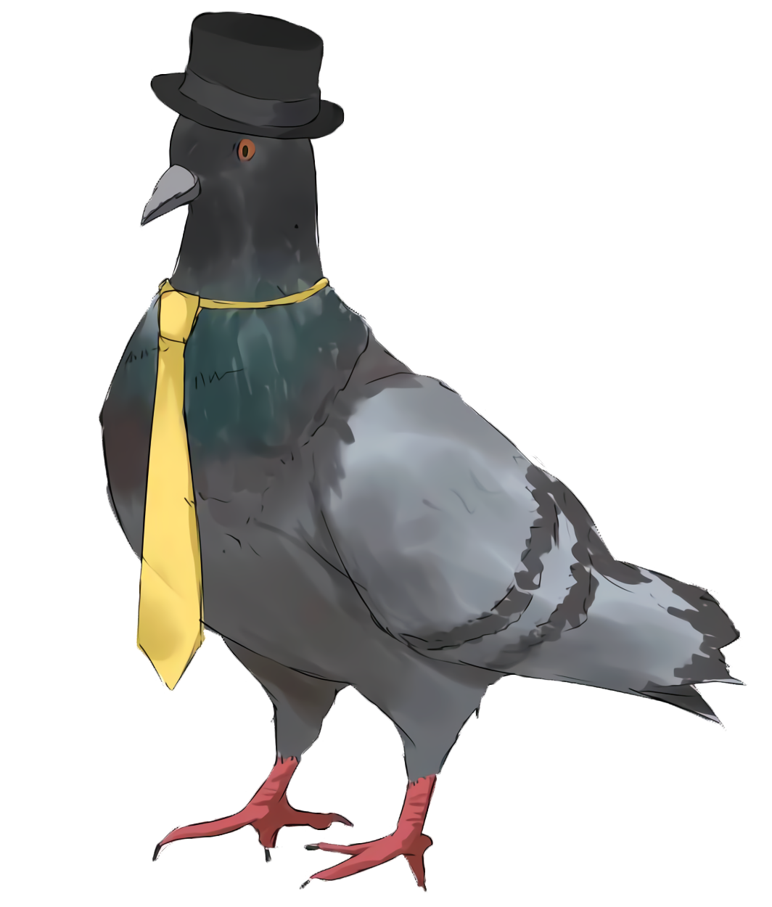

	

# Cozy Production Website
Project Website Cozy Production merupakan penyambung Cozy production terhadap dunia maya. Didalam web ini, akan menunjukkan kreatifitas lingkar karya kreatif cozy production serta memberikan mereka media untuk menjual produk-produk yang mereka buat. tidak hanya itu, website ini akan menyediakan tempat untuk lingkar karya kreatif cozyproduction untuk mengunggah artikel yang mereka tulis. 

Website Cozy Production mencakup beberapa fitur untuk 3 kelompok yang berbeda yaitu pengunjung, pengguna dan admin. Pengujung hanya bisa melihat-lihat website, sementara pengguna bisa melakukan pemesanan barang dan review barang selain melihat-lihat website. Admin memiliki akses ke panel admin dimana admin dapat mengatur produk, tampilan _carousel_, dan mengatur pesanan pengguna.

# Client
Nama: Josua Christian Raymond 
Status: Ketua sekaligus founder dari lingkar karya Cozy Production

	

Josua adalah ketua sekaligus pendiri lingkar karya Cozy Production. Josua pertama kali mendapat ide mendirikan Cozy production dengan alasan ingin mencoba menjual barang di acara pameran Comic Frontier 9 pada tahun 2017. Semenjak itu Cozy Production menjadi lingkar karya yang selalu mengikuti pameran Comic Frontier setiap kali diadakan. Lingar Karya Cozy Production sendiri adalah lingkar karya yang menjual produk bertema "meme" dan anime, dan seringkali dikenal oleh karena produk yang dijualnya tidak sesuai dengan pameran pop-kultur seperti Comic Frontier. Sebagai contoh, Cozy Production pernah mencoba menjual motor dua kali, Rumah, dan mata bor. Selain barang-barang anehnya, Cozy Production menjual barang-barang normal bertema anime seperti poster, kartu pos, baju, _art book_, pin, sticker, gantungan kunci dan lain-lain.

Josua menginginkan adanya sebuah website bagi Cozy Production untuk melanjutkan penjualan diluar waktu pameran Cozy Frontier dan pameran-pameran lainnya. Selain itu Josua menginginkan agar website tersebut memiliki fitur blogging, agar Cozy Production dapat menulis tentang berita dan pengumuman terbaru dari lingkar karya mereka.

Link Media Sosial Cozy Production: 
<ul>
	<li><a href="https://www.facebook.com/BerkaryaDenganSantai">Facebook</a></li>
	<li><a href="https://twitter.com/CPMantep">Twitter</a></li>
	<li><a href="https://www.instagram.com/berkaryadengansantai/">Instagram</a></li>
</ul>

# Team Members
- [ Pramudio ] NIM: 1313619013 <a href="https://github.com/Pramudio-Ilkom">Github</a>  
Pramudio adalah mahasiswa Ilmu Komputer UNJ angkatan 2019. Pramudio bertugas mengurus backend dan Database bersama dengan Raffi.

- [ Nehemiah Austen Pison ] NIM: 1313619021 <a href="https://github.com/EzraelVio">Github</a>  
Nehemiah adalah mahasiswa Ilmu Komputer UNJ angkatan 2019. Nehemiah bertugas dengan Front-end dan tampilan desain. Hal ini dikarenakan desain Nehemiah lah yang terpilih menjad tampilan depan website Cozy Production.

- [ Muhammad Raffi Athallah Miraza ] NIM: 1313619026 <a href="https://github.com/rafimir20">Github</a>  
Raffi adalah mahasiswa Ilmu Komputer UNJ angkatan 2019. Raffi bertugas bersama Pramudio dalem mengurus backend dan Database. Raffi lebih banyak bertugas di implementasi feature terutama feature admin panel.

# Links
<ul>
<li>Website Link:
	<a href="https://cozypro.xyz/">cozypro.xyz</a>

<li>User Manual File:

<li>Website Demonstration Video:

<li>Front Page Demonstration Video:

<li>Client Reception Video:

<li>List of Features
<a href="/doc/spec/List_of_Feature.pdf">List_of_Feature.pdf</a>
</ul>
